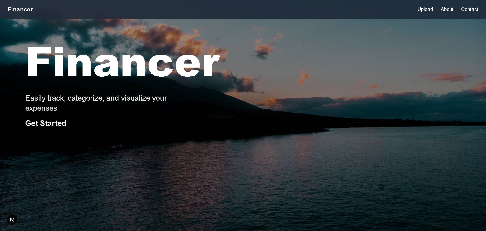
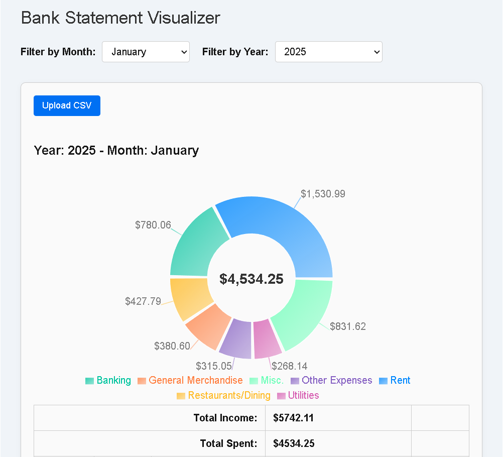

# Finacer Banking App

Upload your bank CSV, and get instant insights with smart categorization and interactive charts.  




---

## Features

- **Pie charts** for spending by category  
- **Filter by month & year**  
- **Smart categorization** based on transaction descriptions  
- **Income & expense summary**  
- Responsive design for desktop & mobile  

---

## Tech Stack

- **React + TypeScript**  
- **Next.js (App Router)**  
- **Recharts** for charts  
- **PapaParse** for CSV parsing  

---

## Quick Start

```bash
git clone https://github.com/channerbok/Home-Expense-Visualizer
cd home-expense-visualizer
npm install
npm run dev
